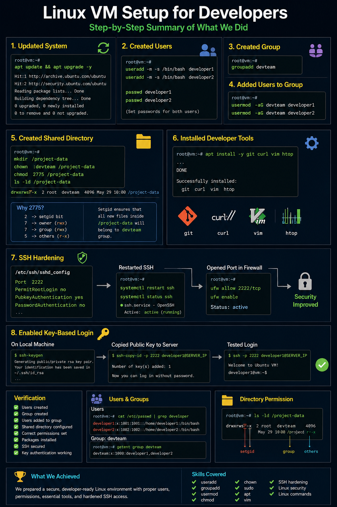

# Task 1: Prepare a Linux VM for Developers 🚀

## Overview 📌

A company has provided a fresh Linux virtual machine. Your job is to prepare the VM so developers can safely log in, collaborate in a shared project directory, and use common development tools.

This task gives you hands-on practice with Linux user management, groups, permissions, package installation, SSH configuration, and basic server security.

## Implementation Preview 🖼️



## What You Will Configure 🛠️

| Area | Requirement |
| --- | --- |
| Users | Create `developer1` and `developer2` |
| Group | Create a group named `devteam` |
| Access | Add both developers to `devteam` |
| Shared folder | Create `/project-data` |
| Permissions | Allow team collaboration using group ownership and setgid |
| Tools | Install `git`, `curl`, `vim`, and `htop` |
| SSH | Disable root login, change SSH port, and enable key-based login |
| Validation | Test login and verify users, groups, services, and permissions |

## Prerequisites ✅

This guide assumes:

- You are using an Ubuntu/Debian-based Linux VM.
- You have `root` access or a user with `sudo` privileges.
- You have terminal access to the VM.
- SSH is already installed and reachable before you begin hardening it.

> 📝 Note: If you are using CentOS/RHEL, replace `apt` commands with the equivalent `yum` or `dnf` commands.

## Phase 1: Update the System 📦

Before creating users or installing tools, update the package index and upgrade existing packages.

```bash
sudo apt update && sudo apt upgrade -y
```

## Phase 2: Create Developer Users 👨‍💻

Create two developer accounts with home directories and Bash as their default shell.

```bash
sudo useradd -m -s /bin/bash developer1
sudo useradd -m -s /bin/bash developer2
```

Set passwords for both users:

```bash
sudo passwd developer1
sudo passwd developer2
```

## Phase 3: Create the Developer Group 👥

Create a shared group called `devteam`.

```bash
sudo groupadd devteam
```

Add both developers to the group:

```bash
sudo usermod -aG devteam developer1
sudo usermod -aG devteam developer2
```

Verify group membership:

```bash
groups developer1
groups developer2
```

Expected output should include `devteam`:

```text
developer1 : developer1 devteam
developer2 : developer2 devteam
```

## Phase 4: Create a Shared Project Directory 📁

Create the shared directory where the development team can work together.

```bash
sudo mkdir /project-data
```

Change the group owner to `devteam`:

```bash
sudo chown :devteam /project-data
```

Set collaborative permissions:

```bash
sudo chmod 2775 /project-data
```

### Why Use `2775`? 🔐

| Permission | Meaning |
| --- | --- |
| `2` | Enables the setgid bit |
| `7` | Owner can read, write, and execute |
| `7` | Group can read, write, and execute |
| `5` | Others can read and execute |

The setgid bit makes new files and folders inside `/project-data` inherit the `devteam` group. This is useful in real DevOps environments where a team shares deployment scripts, configuration files, or project artifacts.

Verify the directory permissions:

```bash
ls -ld /project-data
```

Expected permission pattern:

```text
drwxrwsr-x
```

The `s` in the group permission section confirms that setgid is enabled.

## Phase 5: Install Developer Tools 🧰

Install common tools required by developers and DevOps engineers.

```bash
sudo apt install -y git curl vim htop
```

Verify the installation:

```bash
git --version
curl --version
vim --version
htop
```

## Phase 6: Harden SSH Access 🔒

Open the SSH server configuration file:

```bash
sudo vim /etc/ssh/sshd_config
```

Update or add the following settings:

```text
PermitRootLogin no
Port 2222
PubkeyAuthentication yes
```

### Optional: Disable Password Login ⚠️

Only disable password authentication after key-based login has been tested successfully.

```text
PasswordAuthentication no
```

> ⚠️ Warning: If SSH keys are not configured correctly before disabling password login, you may lock yourself out of the VM.

Restart the SSH service:

```bash
sudo systemctl restart ssh
```

If your distribution uses `sshd` as the service name, use:

```bash
sudo systemctl restart sshd
```

Check the SSH service status:

```bash
sudo systemctl status ssh
```

## Phase 7: Configure SSH Key Login 🔑

Run the following commands from your local machine, not inside the VM.

Generate an SSH key pair:

```bash
ssh-keygen
```

Copy the public key to the server:

```bash
ssh-copy-id -p 2222 developer1@SERVER_IP
```

Example:

```bash
ssh-copy-id -p 2222 developer1@192.168.1.10
```

Test SSH login:

```bash
ssh -p 2222 developer1@SERVER_IP
```

If login succeeds, key-based authentication and the custom SSH port are working.

## Useful Verification Commands 🧪

Use these commands to confirm that the VM is configured correctly.

| Check | Command |
| --- | --- |
| Users | `cat /etc/passwd` |
| Groups | `cat /etc/group` |
| Developer group membership | `groups developer1 && groups developer2` |
| Shared directory permissions | `ls -ld /project-data` |
| Installed SSH port | `sudo ss -tulnp \| grep ssh` |
| SSH service status | `sudo systemctl status ssh` |

## Final Validation Checklist 🎯

- [ ] `developer1` user created
- [ ] `developer2` user created
- [ ] `devteam` group created
- [ ] Both users added to `devteam`
- [ ] `/project-data` directory created
- [ ] `/project-data` owned by the `devteam` group
- [ ] Setgid permission configured with `chmod 2775`
- [ ] `git`, `curl`, `vim`, and `htop` installed
- [ ] Root SSH login disabled
- [ ] SSH port changed to `2222`
- [ ] Key-based SSH login enabled and tested

## Real DevOps Skills Practiced 💼

| Skill | Real-world use |
| --- | --- |
| `useradd` | Developer onboarding |
| `groupadd` and `usermod` | Team access management |
| `chown` and `chmod` | Shared directory permissions |
| setgid | Consistent group ownership for team files |
| `apt` | Server package management |
| SSH hardening | Reducing remote access risk |
| SSH keys | Secure authentication |
| `systemctl` | Managing Linux services |

## Bonus Practice 🔥

Try these after completing the main task:

1. Create a third user named `developer3`.
2. Add `developer3` to the `devteam` group.
3. Research the sticky bit and compare it with setgid.
4. Install and configure a firewall:

```bash
sudo apt install -y ufw
sudo ufw allow 2222/tcp
sudo ufw enable
```

## Interview Answer 🎤

If an interviewer asks, "How do you prepare a Linux VM for developers?", you can answer:

> I create developer users, place them in a shared group, configure a shared project directory with correct ownership and setgid permissions, install common development tools, harden SSH access, enable key-based login, and verify the setup with user, group, permission, package, and service checks.
