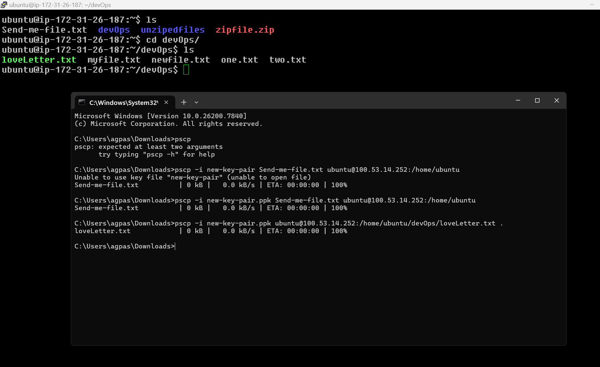

# � File Transfer using PuTTY Secure Copy (PSCP)

## �🔹 What is PSCP?

**PSCP (PuTTY Secure Copy)** is a command-line tool from the PuTTY suite.
It uses the **SSH protocol** for secure file transfer (similar to `scp` in Linux).

It is mainly used on Windows to transfer files between:

- 🖥 **Local machine** ➜ **Remote server**
- 🖥 **Remote server** ➜ **Local machine**

---

## 🔹 Step 1: Download PSCP

### ✅ Method 1 (Recommended – Official Site)

1. Go to: 👉 [PuTTY Download Page](https://www.chiark.greenend.org.uk/~sgtatham/putty/latest.html)
2. Download **`pscp.exe`** (Standalone file) **OR** download the **full PuTTY installer** (which includes `pscp` automatically).

---

## 🔹 Step 2: Place PSCP Properly

You have two options for setting up `pscp.exe`:

### Option A (Easy - Run from anywhere)

- Place `pscp.exe` in `C:\Windows\System32\`
- _This allows you to run the `pscp` command from anywhere in CMD._

### Option B (Run from specific folder)

- Keep it in any folder (like `Downloads`)
- Open `CMD` in that specific folder to run it.

---

## 🔹 Step 3: Basic PSCP Syntax

```bash
pscp [options] source destination
```

---

## 🔹 Transfer File: Local ➜ Remote

**📌 Case: Upload a file to an EC2 server**

**Example Scenario:**

- **Local file:** `C:\Users\Ravi\Desktop\project.zip`
- **Remote server:** `ec2-user@3.110.25.100`
- **PEM key file:** `mykey.pem`

### � Command:

```bash
pscp -i mykey.pem C:\Users\Ravi\Desktop\project.zip ec2-user@3.110.25.100:/home/ec2-user/
```

### 🔎 Explanation:

| Part              | Meaning                          |
| :---------------- | :------------------------------- |
| `-i mykey.pem`    | Identity file (private key)      |
| `project.zip`     | The file you want to upload      |
| `ec2-user@IP`     | Remote username + public IP      |
| `/home/ec2-user/` | Destination folder on the server |

### 📸 Proof of Transfer



---

## 🔹 Transfer Folder (Recursive)

To transfer an entire directory, use the `-r` flag:

```bash
pscp -i mykey.pem -r C:\Users\Ravi\Desktop\myfolder ec2-user@3.110.25.100:/home/ec2-user/
```

---

## 🔹 Download File: Remote ➜ Local

To download a file from the remote server to your local machine:

```bash
pscp -i mykey.pem ec2-user@3.110.25.100:/home/ec2-user/file.txt C:\Users\Ravi\Downloads\
```

---

## ⚠ Important for AWS EC2 Users

If you are using AWS EC2, note the default usernames for different OS images:

- **Amazon Linux** ➜ `ec2-user`
- **Ubuntu** ➜ `ubuntu`
- **CentOS** ➜ `centos`

### ✅ Make sure:

1. **Port 22** is open in your instance's Security Group.
2. Your `.pem` file has the correct permissions.
